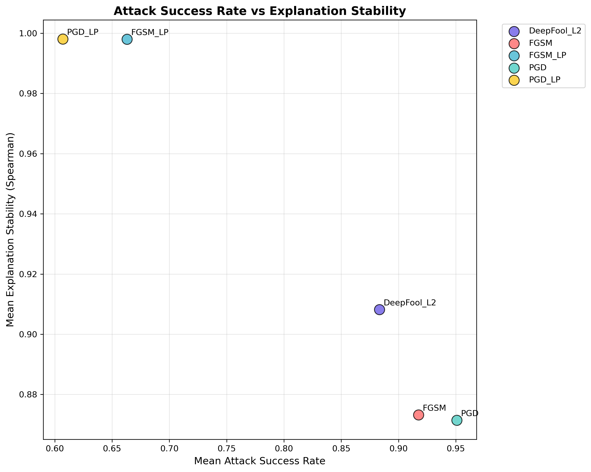
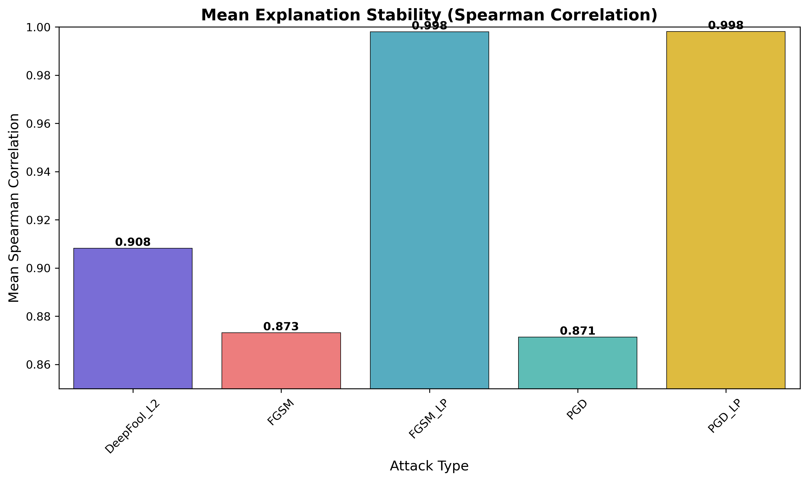
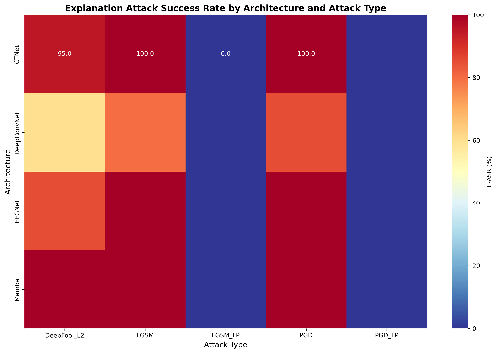

# When Interpretability Fails: Explanation Blindspots in Adversarial EEG Attacks

Adversarial perturbations can degrade EEG classifier performance while leaving Integrated Gradients explanations nearly unchanged — creating a **silent failure mode** for interpretability-based monitoring.

---

## Problem

Interpretability methods are often proposed as safety monitors for neural networks.

This relies on a key assumption:

> If the model fails, the explanation will change.

We test this assumption in EEG motor imagery classification.

If adversarial attacks can break predictions while preserving explanations, then interpretability cannot reliably detect model failure.

---

## Approach

- **Models**: EEGNet, DeepConvNet, CTNet, EEGMamba  
- **Dataset**: BCI Competition IV Dataset 2a (4 subjects, 4-class motor imagery)  
- **Attacks**:
  - Standard: FGSM, PGD, DeepFool-L2  
  - Structured: FGSM-LP, PGD-LP (low-pass constrained)  
- **Budgets**: 0.25–2.0 μV (physiologically grounded)  
- **Explanation method**: Integrated Gradients  
- **Stability metric**: Spearman correlation (clean vs adversarial attributions)

---

## Results

### Baseline accuracy (chance = 25%)

| Model       | Accuracy |
|-------------|----------|
| CTNet       | 60.6%    |
| EEGNet      | 57.9%    |
| EEGMamba    | 52.7%    |
| DeepConvNet | 49.2%    |

---

### Adversarial behaviour

| Attack type | Mean ASR | Explanation Stability (ρ) |
|-------------|----------|--------------------------|
| Standard    | 93.4%    | 0.872                    |
| Low-pass    | 63.5%    | **0.998**                |

Low-pass attacks maintain near-perfect explanation stability while still causing substantial misclassification.

---







Architecture differences were minimal after seed aggregation (Fisher's z test: p = 0.71).

---

## Key Insight

**Interpretability can fail silently.**

- Standard attacks disrupt both predictions and explanations → detectable failure  
- Low-pass attacks disrupt predictions while preserving explanations → undetectable failure  

This violates a core assumption behind interpretability-based monitoring:

> explanations are not reliably coupled to model correctness under distribution shift.

---

## Reproduction

```bash
# Setup
git clone https://github.com/VictoryChianumba/robust-eeg-models.git
cd robust-eeg-models
make venv && make install
source venv/bin/activate

# Train baselines
python scripts/train_baselines.py

# Run adversarial evaluation
python scripts/run_attacks.py

# Run analysis
python scripts/run_analysis.py

# Blindspot analysis
python scripts/run_blindspot.py
